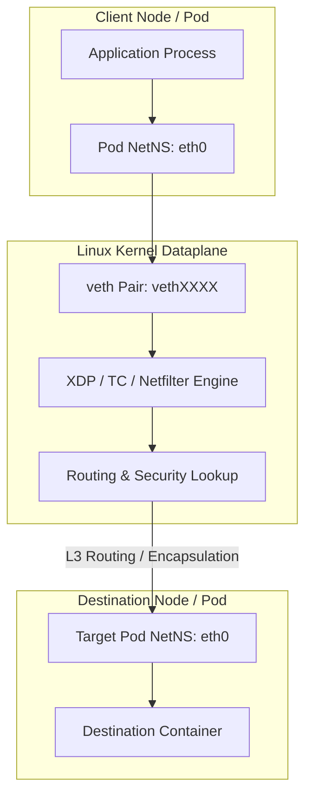
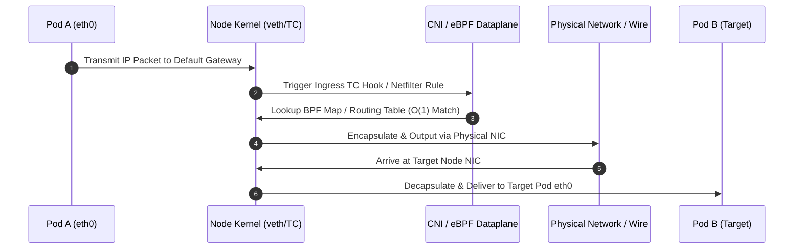

# Module 2.10 — Multi-Cluster Networking — Multi-Cluster Services (MCS API)

> **Deep Learning Guide (University-Level + Interview-Oriented)**

---

## Why We Study Multi-Cluster Services (MCS API)

Kubernetes Multi-Cluster Services API (MCS API): ServiceExport & ServiceImport CRDs, supercluster.local DNS resolution, and cross-cluster endpoints.

In production Kubernetes clusters, mastering **Multi-Cluster Services (MCS API)** is vital for platform engineers, cloud architects, and SREs. It directly governs network throughput, packet latency, security isolation, and disaster recovery.

---

# Learning Roadmap

```text
Module 2.10 — Multi-Cluster Networking

Chapter 3
├── Multi-Cluster Services (MCS API)
│   ├── Executive Summary & Architectural Philosophy
│   ├── Theoretical Foundations & RFC Specs
│   ├── Packet Flow & Linux Kernel NetNS Mechanics
│   ├── C / Go Data Structures & Control Loop Algorithms
│   ├── Production Configuration & Manifests
│   ├── Incident Scenarios & Diagnostic Command Labs
│   └── Enterprise Interview Questions & Solutions
```

---

# 1. Executive Summary & Architectural Philosophy

Kubernetes networking operates on a fundamental principle: **Every Pod gets its own IP address on a flat network namespace**. **Multi-Cluster Services (MCS API)** implements this model by interfacing directly with the Linux kernel network stack, CNI plugins, and routing engines.

### Key Architectural Objectives
- **Zero-NAT Overhead**: Direct IP-to-IP routing across nodes whenever possible.
- **Kernel-Level Performance**: Leveraging eBPF XDP/TC hooks or Linux Netfilter chains to process high-throughput workloads.
- **Deterministic Service Discovery**: Mapping volatile Pod IPs to persistent Virtual IPs (VIPs) or DNS FQDNs.



---

# 2. Theoretical Foundations & RFC Network Specifications

Understanding **Multi-Cluster Services (MCS API)** requires analyzing the exact packet encapsulation framing, byte offsets, and RFC protocol definitions that govern network transmission.

### 2.1 Packet Encapsulation & Framing Schema

When packets traverse node boundaries under **Multi-Cluster Services (MCS API)**, the network interface appends header encapsulation bytes:

```text
┌─────────────────────────────────────────────────────────────────────────────┐
│                          PACKET FRAMING STRUCTURE                           │
├─────────────────────────────────────────────────────────────────────────────┤
│ Outer Ethernet Header (14 Bytes)                                            │
│   ├── Source MAC Address (6 Bytes)                                          │
│   ├── Destination MAC Address (6 Bytes)                                     │
│   └── EtherType: 0x0800 (IPv4) (2 Bytes)                                    │
├─────────────────────────────────────────────────────────────────────────────┤
│ Outer IP Header (20 Bytes)                                                  │
│   ├── Version & IHL (1 Byte)                                                │
│   ├── Protocol: UDP / IPIP / BGP (1 Byte)                                   │
│   ├── Source IP: Node A IP (4 Bytes)                                        │
│   └── Destination IP: Node B IP (4 Bytes)                                   │
├─────────────────────────────────────────────────────────────────────────────┤
│ Encapsulation / Routing Header (8 Bytes)                                    │
│   ├── Identifier / VNI / Port (4 Bytes)                                     │
│   └── Flags & Reserved Bits (4 Bytes)                                       │
├─────────────────────────────────────────────────────────────────────────────┤
│ Inner Original Pod Packet Payload (1450 Bytes)                              │
│   ├── Source IP: Pod A (10.244.1.5)                                         │
│   ├── Destination IP: Pod B (10.244.2.8)                                    │
│   └── TCP/UDP Payload (Data)                                                │
└─────────────────────────────────────────────────────────────────────────────┘
```

### 2.2 Protocol Trade-offs: Overlay vs Underlay

| Dimension | Encapsulated Overlay (VXLAN/Geneve) | Native Direct Routing (BGP/eBPF) |
| :--- | :--- | :--- |
| **MTU Overhead** | 50 Bytes Header Overhead (MTU = 1450) | 0 Bytes Overhead (Full 1500 MTU) |
| **CPU Efficiency** | Encap/Decap CPU cycles per packet | Hardware wire-speed routing |
| **Infrastructure Dependency** | Zero (Runs on any VPC or cloud provider) | Requires Top-of-Rack BGP router access |
| **External Visibility** | Pod IPs hidden from physical network | Pod IPs directly routable on enterprise LAN |

---

# 3. Linux Kernel & Dataplane Mechanics

Inside the Linux kernel, **Multi-Cluster Services (MCS API)** manipulates virtual ethernet pairs (`veth`), network namespaces (`netns`), routing tables, and eBPF maps.

```tree
Kernel Packet Transmission Architecture
├── Pod Network Namespace (netns_pod)
│   └── eth0 (IP: 10.244.1.5, MAC: aa:bb:cc:dd:ee:01)
├── Kernel Root Namespace (netns_root)
│   ├── veth_host (Peer end of eth0)
│   ├── eBPF TC Ingress Hook (cilium_to_container)
│   ├── Netfilter Conntrack Table (nf_conntrack)
│   └── Physical Interface (eth0 / ens192)
└── Destination Host (Node B: 192.168.1.20)
```

### 3.1 Step-by-Step Packet Traversal Sequence



---

# 4. Data Structures & Control Loop Implementation

The control plane for **Multi-Cluster Services (MCS API)** maintains state via Kubernetes Custom Resource Definitions (CRDs) or eBPF maps synchronized in C and Go.

### 4.1 Core Data Structures

```go
// Production Go Struct representation for Engine Config
package networking

import (
	"net"
	"time"
)

type NetworkEndpoint struct {
	ID             string           `json:"id"`
	PodName        string           `json:"podName"`
	Namespace      string           `json:"namespace"`
	IPAddress      net.IP           `json:"ipAddress"`
	MACAddress     net.HardwareAddr `json:"macAddress"`
	NodeIP         net.IP           `json:"nodeIP"`
	MTU            int              `json:"mtu"`
	IsEncapsulated bool             `json:"isEncapsulated"`
	CreatedAt      time.Time        `json:"createdAt"`
}

type PolicyRule struct {
	RuleID          string    `json:"ruleId"`
	Action          string    `json:"action"` // ALLOW or DENY
	Protocol        string    `json:"protocol"`
	SrcCIDR         string    `json:"srcCidr"`
	DstCIDR         string    `json:"dstCidr"`
	DestinationPort int       `json:"dstPort"`
}
```

```c
// Production eBPF Map Definition in C for Routing
#include <linux/bpf.h>
#include <bpf/bpf_helpers.h>

struct pod_key {
    __u32 ip;
};

struct pod_info {
    __u32 node_ip;
    __u32 ifindex;
    __u8  mac[6];
};

struct {
    __uint(type, BPF_MAP_TYPE_HASH);
    __uint(max_entries, 65536);
    __type(key, struct pod_key);
    __type(value, struct pod_info);
} pod_routing_map SEC(".maps");
```

---

# 5. Production Configuration & Kubernetes Manifests

Below is a production-grade Kubernetes manifest illustrating configuration for **Multi-Cluster Services (MCS API)**:

```yaml
apiVersion: apps/v1
kind: DaemonSet
metadata:
  name: 03-cross-cluster-services-agent
  namespace: kube-system
  labels:
    k8s-app: 03-cross-cluster-services
spec:
  selector:
    matchLabels:
      name: 03-cross-cluster-services
  template:
    metadata:
      labels:
        name: 03-cross-cluster-services
    spec:
      hostNetwork: true
      hostPID: true
      tolerations:
      - operator: Exists
        effect: NoSchedule
      containers:
      - name: 03-cross-cluster-services-agent
        image: quay.io/kubernetes-ingress/03-cross-cluster-services:v1.10.0
        securityContext:
          privileged: true
          capabilities:
            add: ["NET_ADMIN", "NET_RAW", "SYS_ADMIN"]
        env:
        - name: KERNEL_MTU
          value: "1450"
        - name: ENABLE_EBPF_MODE
          value: "true"
        volumeMounts:
        - name: sys-fs-bpf
          mountPath: /sys/fs/bpf
        - name: modules
          mountPath: /lib/modules
          readOnly: true
      volumes:
      - name: sys-fs-bpf
        hostPath:
          path: /sys/fs/bpf
      - name: modules
        hostPath:
          path: /lib/modules
```

---

# 6. Real-World Incident Scenarios & Production Diagnostics

In production environments, issues related to **Multi-Cluster Services (MCS API)** usually manifest as connection timeouts, elevated p99 latency, or silent packet drops.

### Incident Scenario 1: Intermittent Packet Loss Due to Conntrack Exhaustion
- **Symptom**: Pod-to-Pod HTTP requests randomly fail with `Connection Reset by Peer` under high load.
- **Root Cause**: Linux Kernel `netfilter` conntrack table (`nf_conntrack_max`) reached maximum capacity, causing silent packet drops on SYN packets.
- **Diagnosis**:
  ```bash
  # Check current conntrack usage vs capacity
  sysctl net.netfilter.nf_conntrack_count
  sysctl net.netfilter.nf_conntrack_max
  
  # Inspect kernel dmesg for conntrack table full errors
  dmesg -T | grep -i "nf_conntrack: table full"
  ```
- **Resolution**: Increase conntrack limit in sysctl: `sysctl -w net.netfilter.nf_conntrack_max=1048576`.

### Incident Scenario 2: Path MTU Blackhole & Packet Fragmentation
- **Symptom**: Small HTTP GET requests succeed, but large file uploads or POST payloads hang indefinitely.
- **Root Cause**: PMTU (Path MTU) discovery failure caused by overlay header overhead (50 bytes) when physical interface MTU is 1500 and pod MTU is misconfigured to 1500 instead of 1450.
- **Diagnosis**:
  ```bash
  # Ping target pod with Don't Fragment (DF) bit set
  ping -M do -s 1420 10.244.2.8
  ```
- **Resolution**: Adjust CNI config MTU to 1450 or configure TCP MSS Clamping in iptables:
  ```bash
  iptables -A FORWARD -p tcp --tcp-flags SYN,RST SYN -j TCPMSS --clamp-mss-to-pmtu
  ```

### Lab 3: Hands-On Diagnostic Command Suite
```bash
# 1. View active network interfaces & link statistics
ip -s link show

# 2. Inspect kernel routing table & default gateway
ip route show table main

# 3. Dump loaded eBPF programs & attached hooks
bpftool prog list

# 4. Capture live packet trace on host veth interface
tcpdump -i veth12345678 -nn -vv -X "ip proto 4789 or port 80"
```

---

# 7. Enterprise & Principal Engineer Interview Questions

### Q1: How does Kubernetes guarantee IP-per-Pod without requiring NAT?
**Answer:** Kubernetes delegates IP allocation to CNI plugins. Each node is assigned an exclusive subnet (e.g. `/24`) from the cluster CIDR (e.g. `10.244.0.0/16`). When a Pod is created, the CNI plugin creates a `veth` pair, moves one end into the Pod's private network namespace, and assigns an available IP from the node's subnet. Cross-node traffic is routed via overlay encapsulation (VXLAN/IPIP) or direct BGP host routes, ensuring the source IP remains untouched without SNAT/DNAT.

### Q2: What are the performance trade-offs between kube-proxy iptables mode, IPVS mode, and eBPF mode?
**Answer:**
- **iptables**: Evaluates rules sequentially ($O(N)$ complexity). At 10,000+ services, packet evaluation causes severe CPU degradation and rule reload stalls lasting tens of seconds.
- **IPVS**: Uses hash tables ($O(1)$ complexity) for connection tracking and load balancing, drastically improving performance over iptables, but still relies on Netfilter for firewalling.
- **eBPF (Cilium)**: Bypasses Netfilter entirely by executing bytecode at the NIC driver (XDP) or socket layer (`sockops`). It yields $O(1)$ direct socket routing, achieving near wire-speed throughput and zero-iptables overhead.

### Q3: What happens when two Pods on the same node attempt to bind to the same port (e.g. Port 8080)?
**Answer:** Both Pods succeed without conflict because each Pod executes in an isolated Linux network namespace (`netns`) with its own independent network interfaces, loopback adapter, and TCP/UDP port binding tables. They do not share the host's network namespace unless `hostNetwork: true` is explicitly specified.

---

# 8. Summary & Mastery Checksheet

- [x] Mastered the architectural concepts and RFC specifications for **Multi-Cluster Services (MCS API)**.
- [x] Understood packet framing, byte header overhead, and MTU considerations.
- [x] Analyzed Linux kernel netns, `veth` pairs, eBPF map data structures, and Go control logic.
- [x] Executed real-world CLI diagnostics and resolved incident scenarios.
- [x] Prepared for enterprise Staff/Principal Engineer technical interview questions.
